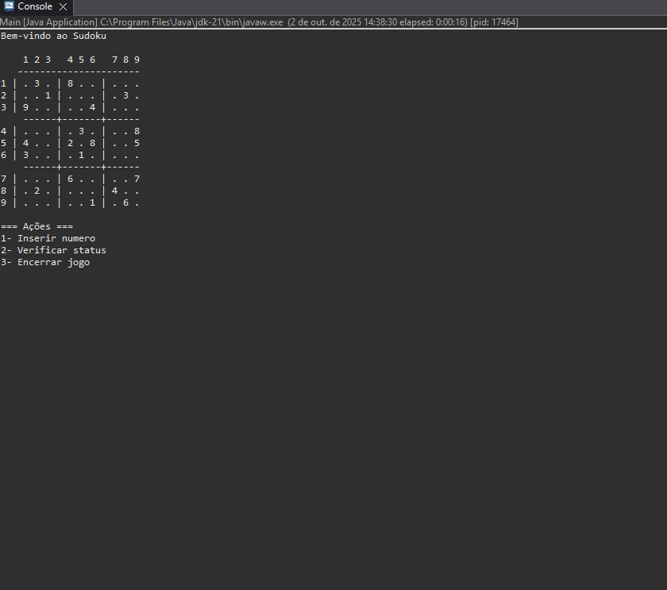

# Sudoku Terminal

Este é um jogo de **Sudoku desenvolvido em Java**, jogado diretamente no **terminal**.
O projeto foi criado como forma de praticar lógica de programação, estrutura de dados e desenvolvimento em Java.

O objetivo é preencher a grade 9x9 seguindo as regras clássicas do Sudoku:
- Cada linha deve conter os números de 1 a 9, sem repetir.
- Cada coluna deve conter os números de 1 a 9, sem repetir.
- Cada subgrade 3x3 deve conter os números de 1 a 9, sem repetir.

## 🎯 Funcionalidades
- Interface no terminal.
- Validação das jogadas.
- Verificação de vitória.
